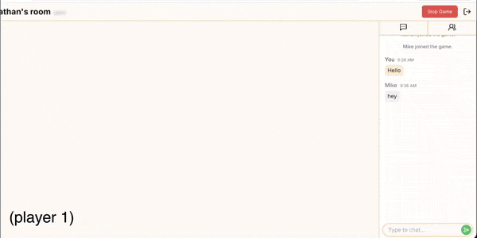

# 🎮  PlayLounge - Real-Time Multiplayer Games

Play real-time multiplayer games with friends, straight from your browser! Try it out [here](http://http://44.195.87.11/).



## 🧠 Purpose and Technical Challenges

I built PlayLounge to set up quick, casual gaming sessions with little overhead. Schedules don’t always align, so with PlayLounge, I can enjoy simple but fun social games with friends, even on limited time.

### 1. Real-Time State Synchronization

The core of this application is **real-time communication** and **event-driven architecture**. The Node.js server maintains and validates the game state, communicating to clients with WebSockets.

- When a player makes a move, the browser emits an event to the server.
- The server validates the move, updates the game state, and  broadcasts it to all clients in-game.
- Components in the React front-end re-render based on this state, ensuring a synchronized game state between players that is reflected in the UI.

### 2. Session Management & Reconnection

To handle network errors or refreshes, I implemented a **session token system**. When a user first joins a lobby, they’re assigned a unique token saved in localStorage. If they disconnect, they’re re-authenticated into the active game with their state intact.

## 🛠️  Tech Stack

- **React + Next.js** on the frontend for smooth UI updates

- **Node.js + Express.js** on the backend for managing game logic and lobbies

- **NGINX** as a reverse proxy to manage incoming requests

- **Docker + Docker Compose** to run the frontend, backend, and NGINX in containers

- **Terraform** to define the infrastructure for hosting the app on AWS EC2

- **Socket.io** for real-time communication and game state updates

## ⚙️ Quick Start

Follow these steps to run the project locally:

1. **Clone the repository:**

```
git clone https://github.com/NDB-7/PlayLounge.git
cd PlayLounge
```


2. **Set up environment variable:** Create a .env file in the root directory.

```
WEBHOOK_URL=<webhook_url_here> # This is the webhook to which feedback is sent
```


3. **Start Docker containers:** Ensure Docker is installed, then run this command.

```
docker compose --env-file .env up -d --build
```

The application will run on port 80.